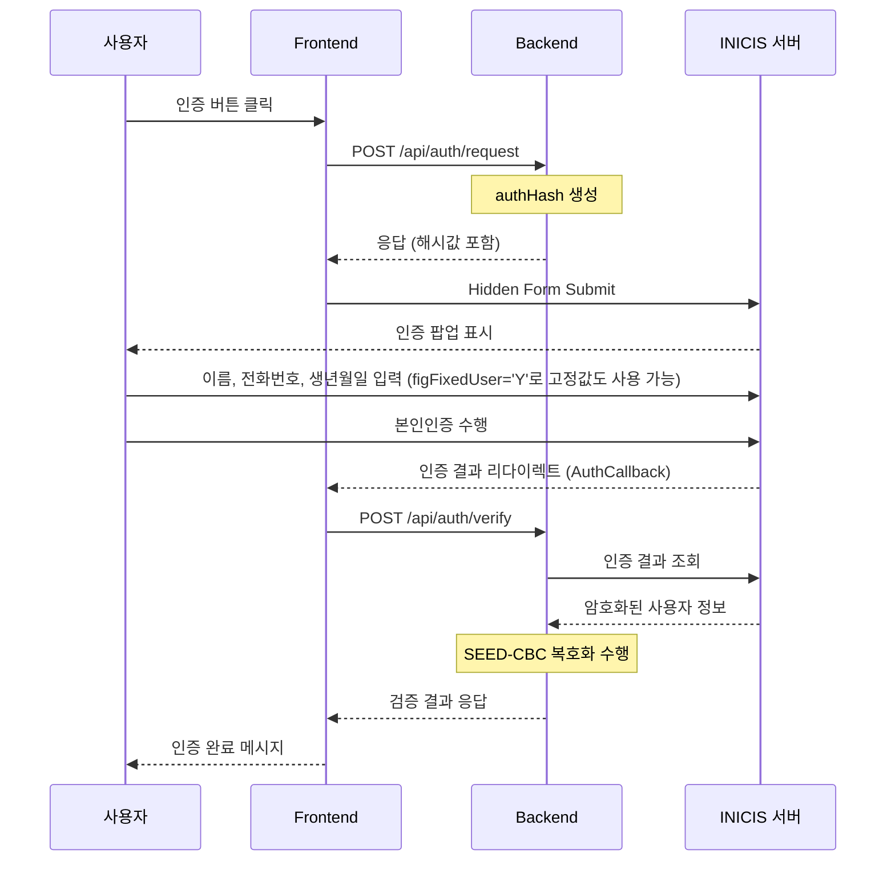

# INICIS 통합인증

## 공식문서
https://manual.inicis.com/sa/auth.html#popup_28

## 구조
```tree
project/
├── client/                # React Frontend
│   ├── src/
│   │   ├── pages/         
│   │   ├── services/      # API
│   │   └── types/         
│   └── package.json
│
├── server/                # NestJS Backend
│   ├── src/
│   │   ├── auth/          # 인증 모듈
│   │   ├── utils/         
│   │   └── kisa-seed/     # SEED 암복호화 모듈
│   └── package.json
```

## 실행
```bash
# client
cd client
npm i
npm run dev

# server
cd server
npm i
npm run start:dev
```

## 인증 프로세스 흐름



## 환경설정
### 1. Frontend(.env)
```bash
# INICIS 가맹점 ID
VITE_INICIS_MID=xxxxx

# 콜백 URL 설정
VITE_SUCCESS_URL=http://localhost:3000/auth/success    # 개발환경
# VITE_SUCCESS_URL=http://서버도메인:3000/auth/success  # 운영환경
VITE_FAIL_URL=http://localhost:3000/auth/fail         # 개발환경
# VITE_FAIL_URL=http://서버도메인:3000/auth/fail       # 운영환경
```
- 환경변수가 없을시 테스트 ID가 적용됩니다.

### 2. Backend(.env)
```bash
# INICIS 가맹점 ID
INICIS_MID=xxxxx

# INICIS API Key
INICIS_API_KEY=xxxxx
```
- 환경변수가 없을시 테스트키와 테스트 ID가 적용됩니다.

